# Box Developer Changelog

[![Tests][cibadge]][cilink]
[![Project Status][opensource_img]][opensource]

This project contain the markdown source for all release notes for Box Platform,
including the APIs, SDKs, UI elements, and CLI.

Visit [`developer.box.com/changelog`][boxdev] to see the latest changes in Box
Platform.

## Manual contributions

To edit any of the existing release notes, please have a look at the
[`./content`](./content) folder.

Please follow the [contribution guidelines](./CONTRIBUTING.md) when contributing
to the source of this project.

1. [Installation & setup](./docs/index.md)
1. [Notes for Box employees](./docs/boxers.md)
1. [The project structure](./docs/structure.md)
1. [Adding a new release note](./docs/add-release-note.md)
1. [Contributing a pull request](./docs/pull-request.md)
1. [Markdown style guide](./docs/markdown.md)

### Quick Start & Templates

The quickest way to start adding a new release note is to use the build in
templates and generator.

```bash
git clone git@github.com:box/box-developer-changelog.git box-developer-changelog
cd box-developer-changelog
yarn install
cp .env.example .env
yarn new
```

The `yarn new` command will take you through a set of questions and will then
create a new entry based on the [standard](./templates/standard.md) template. A
[short](..templates/short.md) template is also available when working with more
complex changes. 

## Automatic contributions

This project has been set up to automatically pull in new release notes from the
[Box CLI, Java, Windows, and .NET SDKs, and UI
elements](https://github.com/box/sdks).

When a new GitHub release is created for one of these repositories, a GitHub
Action will send a notification to this repository which will trigger off
another GitHub action in this project that pulls in the content and opens a new
Pull Request.

Once the pull request is created, another process will kick off to test and lint
the new content and automatically merge the pull request. This new content will
then be compiled and pushed to the `en` branch, where it will be picked up by
Netlify to be combined with all other developer content and pushed to
[`developer.box.com`](https://developer.box.com).

<details>
  <summary>A flow chart of this process</summary>
  
  

</details>

## Translation

The content in this repository is automatically translated to Japanese by our
in-house translation team. Once a day a snapshot will be made from the `en` to
the `en-snapshot` branch. Then, once translated, the new Japanese content is
pushed to the `jp` branch where it is picked up by Netlify and combined with all
other translated content and pushed to
[`ja.developer.box.com`](https://ja.developer.box.com).

## Usage & License

Copyright 2020 Box, Inc. All rights reserved.

Licensed under the Apache License, Version 2.0 (the "License"); you may not use
this file except in compliance with the License. You may obtain a copy of the
License at <http://www.apache.org/licenses/LICENSE-2.0>.

Unless required by applicable law or agreed to in writing, software distributed
under the License is distributed on an "AS IS" BASIS, WITHOUT WARRANTIES OR
CONDITIONS OF ANY KIND, either express or implied. See the License for the
specific language governing permissions and limitations under the License.

[license]: LICENSE
[contrib]: CONTRIBUTING.md
[boxdev]: https://developer.box.com/changelog
[opensource]: http://opensource.box.com/badges
[cibadge]: https://github.com/box/box-developer-changelog/workflows/Tests/badge.svg
[cilink]: https://github.com/box/box-developer-changelog/actions?query=workflow%3ATests

[opensource_img]: https://opensource.box.com/badges/active.svg
