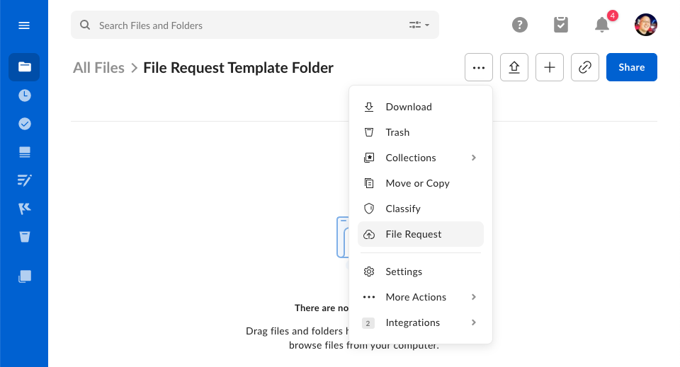
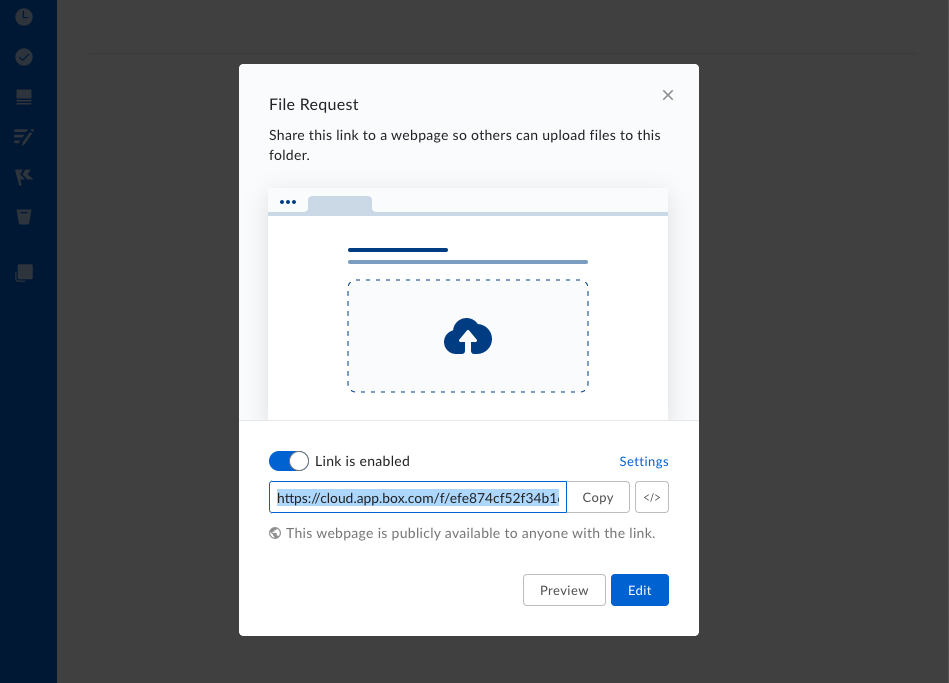

# New File Request APIs available

A new collection of APIs are now available that allows developers to create 
and update File Requests. We've updated the reference documentation for this 
[File Request API][copy].

To create a copy of an existing file request, all you need is the ID
of an existing file request, and the ID of a folder to apply the new request to.

```curl
curl -i -X POST "https://api.box.com/2.0/file_requests/42037322/copy" \
     -H "Authorization: Bearer <ACCESS_TOKEN>" \
     -d '{
       "folder": {
         "id": "2233212"
       }       
     }'
```

<!-- more -->

## Creating a first file request

To create a new file request via the API, a template file request will
need be created on any folder in your Box account via the Box web app.

To create a file request, select a folder, and click the 3 dots at the top
of the page. Then, select **File Request** from the menu.



In the next configuration panel, click the **Edit** button
to visit the file request configuration page.



On the configuration page, you can set configure the title and description,
before saving the page.

This page will also have the ID of the file request in the URL. Make a
note of this as you will need it in the next step.


## Copy a template file request

To copy a template file request, you will need the ID of the original
file request, and the ID of the folder to apply a copy of the file
request to.

Both of this IDs can be determined by visiting the file request and folder
in the browser and making a note of the ID. For example:

* `https://*.app.box.com/filerequest/2342235` is a file request with ID `2342235`.
* `https://*.app.box.com/folder/342323423` is a folder with ID `342323423`.

Now, with both of these at hand, you can create a copy of the file request on
the folder. It is even possible to update some of the settings at the same time.

```curl
curl -i -X POST "https://api.box.com/2.0/file_requests/2342235/copy" \
     -H "Authorization: Bearer <ACCESS_TOKEN>" \
     -d '{
       "title": "Please upload required documents",
       "description": "Please upload required documents",
       "status": "ACTIVE",
       "is_email_required": true,
       "is_description_required": false,
       "folder": {
         "id": "342323423"
       }
     }'
```

<Message note>

Additional APIs are available that allow a developer to 
[get more details about a file request][get], 
[update a file request][put], and 
[delete a file request][del]. 

</Message>

---

For more details, please check out our new file request documentation.

* File request guides
* Update API reference documentation
  * [`POST /file_requests/:id/copy`][copy] - Create a copy of a file request.
  * [`GET /file_requests/:id`][get] - Get information about a file request.
  * [`PUT /file_requests/:id`][put] - Update a file request's configuration.
  * [`DELETE /file_requests/:id`][del] - Delete a file request.

[copy]: e://post_file_requests_id_copy
[get]: e://get_file_requests_id
[del]: e://delete_file_requests_id
[put]: e://put_file_requests_id

